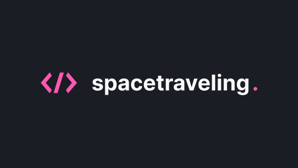

<h1 align="center">Space Traveling</h1>
<p align="center">
  <a href="#demonstracao">Demonstração</a>
  &nbsp;&nbsp;&nbsp;|&nbsp;&nbsp;&nbsp;
  <a href="#tecnologias">Tecnologias</a>
  &nbsp;&nbsp;&nbsp;|&nbsp;&nbsp;&nbsp;
  <a href="#projeto">Projeto</a>
  &nbsp;&nbsp;&nbsp;|&nbsp;&nbsp;&nbsp;
  <a href="#como-executar">Como executar</a>
</p>

<p align="center">
  <a target="_blank" rel="noopener noreferrer" href=".github/capa.png">
    
   </a>
</p>

<a id="demonstracao"></a>
## 💻 Demonstração

<p align="center">
  <a target="_blank" rel="noopener noreferrer" href=".github/demo.png">
    
   </a>
</p>

<a id="tecnologias"></a>
## ✨ Tecnologias

- <a href="https://reactjs.org">React</a>
- <a href="https://www.typescriptlang.org/">TypeScript</a>
- <a href="https://nextjs.org/">Next</a>
- <a href="https://prismic.io/">Prismic</a>
- <a href="https://utteranc.es/">Utterances</a>
</ul>

<a id="projeto"></a>
## 🛠️ Projeto
Quinto desafio proposto dentro do bootcamp da Rocketseat onde um blog tinha que ser desenvolvido do zero com Prismic CMS a partir de um layout do Figma.

<a id="como-executar"></a>
## 👨‍💻 Como executar
- Clone o repositório
- Instale as dependências com ```yarn```
- Inicie o servidor com ```yarn dev```

É preciso ter uma conta e configurada e um repositório dentro do <strong><a href="https://prismic.io/">Prismic</a></strong>.

Agora é só acessar ```localhost:3000``` no navegador.
